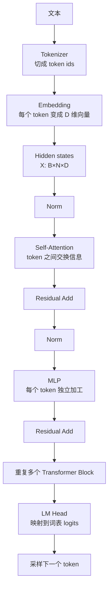
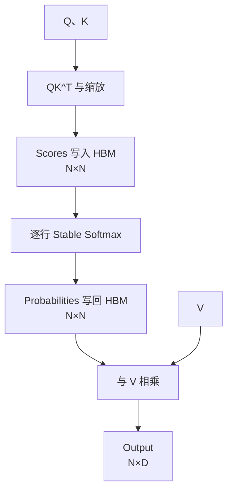
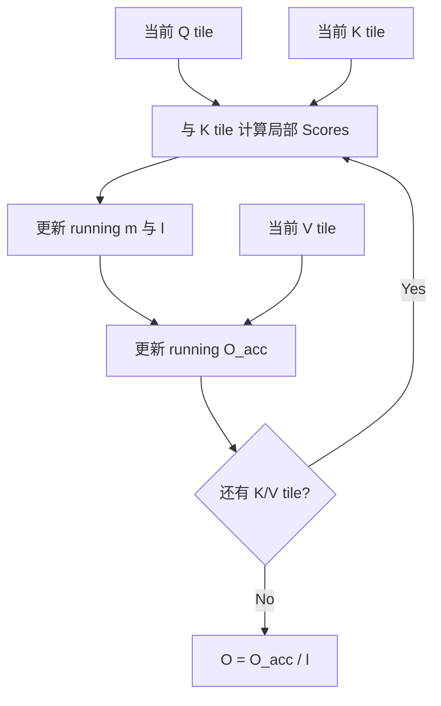

# FlashAttention 复习与作品实施手册（临时）

> [!IMPORTANT]
> 本文档是实现期间使用的临时学习材料，不是最终作品说明。核心 Kernel 必须由学习者亲手实现；作品完成并形成正式 README、实验方法和结果文档后删除本文档。

## 1. 使用方式

这次不把旧学习仓库中的实现复制过来。旧代码和历史 session 只用于整理知识、恢复踩坑记录以及在独立尝试失败后查漏补缺。

每一阶段严格使用下面的顺序：

1. 先读本阶段的概念、公式和验收条件；
2. 关闭本文档，独立画数据流和写核心代码；
3. 连续尝试 30～60 分钟；
4. 卡住时只请求一级提示；
5. correctness 通过后再 review；
6. 最后才运行 benchmark、ncu 和 SASS 检查。

三级提示规则：

| 级别 | 可以提供 | 不提供 |
| --- | --- | --- |
| 一级 | 不变量、检查方向、应观察的错误现象 | 代码答案 |
| 二级 | 出错的数据流、索引阶段或同步阶段 | 完整循环 |
| 三级 | 局部公式或伪代码 | 完整 Kernel |

### 1.1 首版作品边界

```text
GPU：NVIDIA A100 80GB PCIe，sm_80
输入/累加：FP32
布局：单 batch、单 head、row-major
Q/K/V：[N, D]
Output：[N, D]
D：首版支持 D <= 128
模式：causal / non-causal
尺寸：支持 N 非 tile 整除
版本：naive materialized / online tiled / cp.async pipelined
```

首版定位是 **Educational FP32 FlashAttention Dataflow**，不是生产级 FlashAttention-2。以下内容不在首版范围：

- backward；
- dropout；
- 多 batch、多 head 和变长序列；
- FP16/BF16 Tensor Core；
- warp specialization；
- FlashAttention-2 的 query-block 并行映射；
- Hopper TMA/WGMMA；
- 与官方 FlashAttention 宣称同级性能。

## 2. 已学内容回顾

历史学习中已经亲手完成过：

- 三阶段朴素 Attention；
- stable softmax 与 online softmax；
- running `m/l/O_acc`；
- K/V tile 和 causal mask；
- 非整除 `N`；
- K/V `cp.async` 双缓冲；
- ncu stall 对比。

历史实现修过的真实问题：

1. `m/l/O_acc` 未初始化；
2. `causal=false` 时仍然执行 mask；
3. 缺少同步，下一 tile 覆盖仍被读取的 K/V；
4. 最后一块 `valid` 使用了上一轮的值；
5. 空状态计算 `-INF - (-INF)` 产生 NaN；
6. 双缓冲中当前 stage、下一 stage 和各自有效行数混淆；
7. 异步拷贝指标改善，但小 grid 填不满 A100，墙钟没有同比改善。

这些旧实现是“做过”的证据，但这次作品要求从干净接口重建，目标从“看提示能完成”提升到“能独立推导、实现和证明”。

## 3. 从文本到 Attention：先把大图建立起来

这一章从最基础概念开始。阅读目标不是背深度学习术语，而是回答三个问题：

1. Q、K、V 从哪里来；
2. Attention 在 Transformer 中负责什么；
3. 最后为什么会落到你熟悉的 GEMM、Softmax 和 CUDA tiling。

完整数据流：



### 3.1 Token：模型看到的不是字符串

模型不能直接计算“我爱 CUDA”这样的字符串。Tokenizer 先把文本切成 token，再把每个 token 映射成整数 ID：

```text
文本：     "我爱 CUDA"
token：   ["我", "爱", " CUDA"]
token id：[17, 42, 913]
```

Token 不一定等于一个汉字或一个完整单词，也可能是：

- 一个英文词的一部分；
- 标点；
- 空格与字符的组合；
- 高频短语。

CUDA Kernel 不处理字符串，而是处理这些 token 经过模型转换后的浮点张量。

### 3.2 Embedding：把离散 ID 变成向量

每个 token ID 会到 embedding table 中查出一行长度为 `D` 的向量：

```text
token_id = 17
    ↓ 查表
embedding = [0.12, -0.31, 0.08, ...]  共 D 个数
```

一条长度为 `N` 的序列会形成矩阵：

$$
X\in\mathbb{R}^{N\times D}
$$

例如：

```text
N = 3 个 token
D = 4 维

X = [[x00, x01, x02, x03],
     [x10, x11, x12, x13],
     [x20, x21, x22, x23]]
```

这里：

- 每一行对应一个 token；
- 每一列对应向量的一个 feature；
- 一整行就是该 token 当前的向量表示。

### 3.3 Hidden state：token 在模型内部的当前表示

Embedding 只是 token 进入模型时的初始表示。每经过一个 Transformer Block，token 吸收上下文并经过 MLP 加工，向量内容都会变化。这个在模型内部不断更新的向量叫 **hidden state**。

```text
初始 embedding
    ↓ 第 1 层：读上下文、加工
hidden state 第 1 版
    ↓ 第 2 层：继续读上下文、加工
hidden state 第 2 版
    ↓ ...
最后一层 hidden state
```

一句话：

> Hidden state 是模型在当前层对每个 token 的“理解结果”，shape 通常仍是 `[B,N,D]`。

这里的 “hidden” 不是“程序员看不到”，只是神经网络术语，表示模型内部状态而非最终输出。

### 3.4 Shape：张量每一维代表什么

常见 shape：

| Shape | 含义 |
| --- | --- |
| `[N,D]` | 单条序列，`N` 个 token，每个 token `D` 维 |
| `[B,N,D]` | `B` 条序列组成 batch |
| `[B,H,N,D_h]` | 拆成 `H` 个 Attention head |

符号：

| 符号 | 含义 | 例子 |
| --- | --- | ---: |
| `B` | batch size | 4 |
| `N` | sequence length | 2,048 |
| `D` | 模型 hidden dimension | 4,096 |
| `H` | query head 数 | 32 |
| `D_h` | 每个 head 的维度 | 128 |

通常：

$$
D=H\times D_h
$$

例如 `D=4096,H=32`：

$$
D_h=4096/32=128
$$

> [!IMPORTANT]
> 后文 FlashAttention Kernel 里的 `D` 指首版单 head 的维度，本质上对应真实模型里的 `D_h`，不是整个模型的 hidden dimension。

### 3.5 多维 shape 最终仍是一维内存

二维 row-major `[N,D]`：

$$
\operatorname{offset}(n,d)=nD+d
$$

四维 row-major `[B,H,N,D_h]`，最右侧 `d` 连续：

$$
\operatorname{offset}(b,h,n,d)
=((bH+h)N+n)D_h+d
$$

可以逐层理解：

```text
b
→ b×H + h
→ (b×H+h)×N + n
→ ((b×H+h)×N+n)×Dh + d
```

口诀：**每向里进入一维，就用当前编号乘这一维大小，再加当前坐标。**

这和 GEMM 的 `row * width + col` 完全相同，只是多套了几层。

### 3.6 Transformer Block：Attention 不是整个模型

一个简化的 pre-norm Transformer Block：

$$
Y=X+\operatorname{Attention}(\operatorname{Norm}(X))
$$

$$
Z=Y+\operatorname{MLP}(\operatorname{Norm}(Y))
$$

可以把两部分记成：

| 组件 | 作用 | 计算特点 |
| --- | --- | --- |
| Attention | token 之间交流，每个 token 从其他 token 读取信息 | 跨 token |
| MLP/FFN | 每个 token 对已经收集到的信息独立加工 | 不跨 token |
| Norm | 控制数值尺度，稳定训练/推理 | 行内归约与逐元素 |
| Residual | 保留原信息并改善深层网络传播 | 向量加法 |

你以前写过的 Kernel 在这里都有位置：

| 已学 CUDA 内容 | Transformer 中的位置 |
| --- | --- |
| GEMM/GEMV | Q/K/V 投影、Attention 矩阵乘、MLP |
| Softmax | Attention 权重、最终词表采样前概率 |
| RMSNorm/LayerNorm | Transformer Block 的 Norm |
| SiLU/GELU | MLP 激活函数 |
| Reduction | Norm、Softmax、max/sum |

### 3.7 投影：神经网络术语，代码里就是 GEMM

当前 hidden states 为：

$$
X\in\mathbb{R}^{N\times D}
$$

通过训练得到的三个权重矩阵：

$$
Q=XW_Q,\qquad K=XW_K,\qquad V=XW_V
$$

“线性投影”听起来抽象，实际上就是矩阵乘：

```text
X [N,D] × Wq [D,D] → Q [N,D]
X [N,D] × Wk [D,D] → K [N,D]
X [N,D] × Wv [D,D] → V [N,D]
```

真实实现常把三个投影融合为一次较大的 GEMM，再切分结果。本文为了理解语义，仍分别写成 Q/K/V。

### 3.8 Q、K、V 到底是什么

Q、K、V 通常来自同一份输入 `X`，只是乘了不同的权重矩阵，因此承担不同角色：

| 名称 | 直觉问题 | 在计算中的作用 |
| --- | --- | --- |
| Query | 当前 token 想找什么？ | 与所有 Key 点积 |
| Key | 当前 token 可以用什么特征被匹配？ | 决定匹配分数 |
| Value | 如果当前 token 被关注，实际贡献什么内容？ | 被 Softmax 权重加权汇总 |

以“动物没有过马路，因为它太累了”为直觉例子，更新“它”的表示时：

1. “它”的 Query 表达它当前需要寻找的上下文；
2. 所有 token 的 Key 与该 Query 匹配；
3. 如果“动物”的 Key 得分高，它的 Value 就以更大权重进入“它”的新表示。

这个例子只帮助建立直觉。真实 Q/K/V 是连续向量，模型通过训练自动学习怎样匹配。

### 3.9 为什么同一个 X 要变成三份

如果匹配特征和传递内容强制使用同一向量，表达能力会受限。分成 Q/K/V 后，模型可以分别学习：

- 用哪些特征发起查询；
- 用哪些特征接受匹配；
- 真正传递哪些内容。

类比数据库检索：查询条件、索引键和返回记录不是同一个概念。但神经网络中的 Q/K/V 都是浮点向量，不要把类比当成严格定义。

### 3.10 Self-Attention 与 Cross-Attention

| 类型 | Q 来自 | K/V 来自 | 常见用途 |
| --- | --- | --- | --- |
| Self-Attention | 当前序列 X | 当前序列 X | GPT/LLM 内部 token 交流 |
| Cross-Attention | 一组 hidden states | 另一组 hidden states | 编码器-解码器、多模态 |

本作品只实现 Self-Attention，所以 Q/K/V 对应相同序列长度 `N`。

### 3.11 多头 Attention

单头只在一个表示空间中计算关系。多头把 hidden dimension 划分成 `H` 个子空间，每个 head 独立做 Attention：

```text
投影后：[B,N,D]
reshape：[B,N,H,Dh]
重排后：[B,H,N,Dh]
```

对每个 `(b,h)`：

```text
Q/K/V：[N,Dh]
Scores：[N,N]
Output：[N,Dh]
```

所有 head 的输出再拼回 `[B,N,D]`，经过输出投影 `W_O`。

> [!WARNING]
> Attention head 是模型数学维度，CUDA warp 是硬件执行单位。二者没有“一 head 等于一 warp”的固定关系。

首版作品固定 `B=1,H=1`，不是因为真实模型只有一个 head，而是先把每个 `(batch,head)` 内部相同的核心数据流独立验证。

### 3.12 位置信息与 RoPE

只看内容向量的 Attention 本身没有足够的顺序意识。语言中“我打了他”和“他打了我”顺序不同，因此模型还要注入位置信息。

现代 LLM 常对 Q/K 应用 RoPE，使点积携带相对位置信息。对于本作品：

- 输入 Q/K 视为已经完成所需位置编码；
- FlashAttention Kernel 只负责给定 Q/K/V 的 Attention；
- 首版不在 Kernel 内实现 RoPE fusion。

这条边界很重要：Attention Kernel 接收 Q/K/V，不负责从文本生成它们，也不负责完整 Transformer Block。

### 3.13 模型如何生成下一个 token

最后一层 hidden state 经过 LM Head 投影到整个词表：

$$
\mathrm{hidden}[D]\times W_{vocab}[D,V]\rightarrow\mathrm{logits}[V]
$$

其中 `V` 是 vocabulary size。模型再从 logits 对应的概率分布中选择或采样下一个 token，把新 token 接到序列末尾后继续运行。

```text
输入："我爱"
→ 预测："C"
输入："我爱C"
→ 预测："U"
输入："我爱CU"
→ 预测："DA"
```

这种逐 token 生成叫 autoregressive decoding。

### 3.14 Prefill 与 decode

一次生成请求通常包含一次 prefill 和多次 decode：

| 阶段 | 输入 | Query 数量 | K/V 范围 | 典型计算形态 |
| --- | --- | ---: | ---: | --- |
| Prefill | 整个 prompt | 同时处理多个 token | prompt 全部 token | 大 GEMM、Attention 并行度高 |
| Decode | 每轮新生成一个 token | 每请求通常 1 个新 query | 全部历史 KV cache | GEMV/小 M GEMM、KV 读取突出 |

Decode 不会重新计算所有历史 token 的 K/V，而是把它们保存到 KV cache。每轮只生成新 token 的 Q/K/V，把新 K/V 追加进 cache，再让新 Query 读取历史 cache。

本作品实现 `[N,D]` 的完整 self-attention forward，主要表达 prefill 风格的数据流。它能帮助理解 decode attention 的 Online Softmax，但不是 PagedAttention 或完整 KV-cache Kernel。

### 3.15 从这些概念回到 CUDA

把神经网络术语翻译成已经熟悉的 CUDA 问题：

```text
Q/K/V 投影       → GEMM
QK^T             → GEMM / tiled dot products
逐行 Softmax     → max + exp-sum reduction
PV               → GEMM / weighted accumulation
不物化 N×N      → fusion + tiling + running state
预取下一 K/V tile → cp.async pipeline
```

因此 FlashAttention 不是一套完全陌生的 CUDA 技术，而是把 GEMM、Reduction、Shared Memory、Register Accumulator 和 Pipeline 按 Attention 的数学依赖重新组合。

### 3.16 概念自测

1. Token ID 和 embedding 有什么区别？
2. Hidden state 为什么每经过一层都会改变？
3. Attention 和 MLP 在 Transformer Block 中分别负责什么？
4. “投影”落到代码中是什么操作？
5. Q/K/V 通常来自哪里，为什么要分成三份？
6. `D=4096,H=32` 时 `D_h` 是多少？
7. 首版 Kernel 中的 `D` 对应模型的 `D` 还是 `D_h`？
8. Self-Attention 与 Cross-Attention 的输入来源有什么区别？
9. Attention head 与 CUDA warp 为什么不能画等号？
10. Prefill 与 decode 的 Query shape 为什么不同？

## 4. 标准 Scaled Dot-Product Attention

单 head 输入：

```text
Q：[N,D]
K：[N,D]
V：[N,D]
```

完整公式：

$$
O=\operatorname{softmax}\left(\frac{QK^T}{\sqrt D}+M\right)V
$$

其中 `M` 是可选 mask。

### 4.1 第一步：计算 Scores

$$
S_{ij}=\frac{1}{\sqrt D}\sum_{x=0}^{D-1}Q_{ix}K_{jx}
$$

Shape：

$$
[N,D]\times[D,N]=[N,N]
$$

固定 query `i` 后，第 `i` 行有 `N` 个 score，分别表示它与所有 key `j` 的匹配程度。

数学上写 `K^T`，不表示代码必须先生成一份转置矩阵。读取 `K[j,x]` 就是在访问 `K^T` 的第 `x,j` 个元素。

### 4.2 为什么除以 `sqrt(D)`

若每一维乘积的量级近似稳定，累加 `D` 项后点积分布的方差会随 `D` 增长。logit 过大会让 softmax 接近 one-hot，数值和梯度都不稳定。乘以：

$$
\frac{1}{\sqrt D}
$$

把 score 拉回较稳定的量级。

### 4.3 causal mask

自回归场景中，query `i` 只能看自己和过去的 key：

$$
S_{ij}=-\infty,\qquad j>i
$$

不能简单写 `0`，因为：

$$
\exp(0)=1
$$

写 `0` 后未来位置仍会获得非零权重；写 `-∞` 后：

$$
\exp(-\infty)=0
$$

### 4.4 Softmax 沿哪个维度

固定 query `i`，沿 key 轴 `j` 做 softmax：

$$
P_{ij}=\frac{e^{S_{ij}-m_i}}{\sum_t e^{S_{it}-m_i}}
$$

$$
m_i=\max_j S_{ij}
$$

每一行满足：

$$
\sum_j P_{ij}=1
$$

### 4.5 用权重汇总 V

$$
O_{ix}=\sum_{j=0}^{N-1}P_{ij}V_{jx}
$$

Shape：

$$
[N,N]\times[N,D]=[N,D]
$$

一句话：`QK^T` 决定“看多少”，`PV` 决定“读到什么”。

### 4.6 用 `N=3,D=2` 手算一条 query

为了第一遍容易理解，暂时设 `Q=K=V=X`：

$$
X=\begin{bmatrix}
1&0\\
0&1\\
1&1
\end{bmatrix}
$$

> [!NOTE]
> 真实模型中 Q/K/V 会经过不同投影，通常并不相等。这里设成相等只为减少手算干扰。

先计算：

$$
QK^T=
\begin{bmatrix}
1&0&1\\
0&1&1\\
1&1&2
\end{bmatrix}
$$

因为 `D=2`：

$$
\frac{1}{\sqrt 2}\approx0.7071
$$

第 0 条 query 的三个 Scores：

$$
S_0=[0.7071,\ 0,\ 0.7071]
$$

Stable Softmax 先减最大值 `0.7071`：

$$
e^{S_0-m}=[1,\ e^{-0.7071},\ 1]
\approx[1,\ 0.4931,\ 1]
$$

分母：

$$
l\approx2.4931
$$

权重：

$$
P_0\approx[0.4011,\ 0.1978,\ 0.4011]
$$

用权重汇总三条 Value：

$$
O_0
=0.4011[1,0]+0.1978[0,1]+0.4011[1,1]
$$

$$
O_0\approx[0.8022,\ 0.5989]
$$

逐步解释：

1. Query 0 与 Key 0、2 的点积更大；
2. Softmax 后 Key 0、2 各获得约 `40.11%` 权重；
3. Key 1 获得约 `19.78%` 权重；
4. 这三个权重乘的是对应的 Value 行；
5. 输出仍然是一条长度为 `D=2` 的向量。

如果启用 causal，query 0 只能看 key 0：

```text
原 Scores：[0.7071, 0, 0.7071]
mask 后：  [0.7071, -∞, -∞]
softmax：  [1, 0, 0]
输出：     V[0] = [1,0]
```

### 4.7 从单条 query 扩展到整张矩阵

上面的计算对每个 query 行都重复一次：

```text
query 0 → Scores 第 0 行 → Softmax 第 0 行 → Output 第 0 行
query 1 → Scores 第 1 行 → Softmax 第 1 行 → Output 第 1 行
query 2 → Scores 第 2 行 → Softmax 第 2 行 → Output 第 2 行
```

所以：

- 一条 query 得到 `N` 个 Scores；
- `N` 条 query 一共得到 `N×N` Scores；
- 每条 query 最终得到一个 `D` 维输出；
- `N` 条 query 最终输出 shape 为 `[N,D]`。

这也是 naive CUDA 版本为什么自然拆成：

```text
二维 QK Kernel → 一 block 一行 Softmax → 二维 PV Kernel
```

## 5. Naive materialized 数据流

朴素版本分成三个 Kernel：



如果 softmax 原地改写 Scores，只需要一份 `N×N` buffer，但它仍然要在多个 Kernel 之间写入和读回 HBM。

### 5.1 计算量

忽略 softmax 和低阶项：

$$
QK^T\approx 2N^2D\ \text{FLOP}
$$

$$
PV\approx 2N^2D\ \text{FLOP}
$$

合计：

$$
\approx 4N^2D\ \text{FLOP}
$$

### 5.2 中间存储

FP32 Scores buffer 大小：

$$
4N^2\ \text{bytes}
$$

| `N` | `N²` 元素 | 单份 FP32 Scores |
| ---: | ---: | ---: |
| 2,048 | 4,194,304 | 16 MiB |
| 8,192 | 67,108,864 | 256 MiB |
| 32,768 | 1,073,741,824 | 4 GiB |

这只是单 batch、单 head 的单份中间矩阵。

## 6. Stable Softmax

直接计算 `exp(x)` 可能上溢。Stable Softmax 先减去整行最大值：

$$
m=\max_j x_j
$$

$$
l=\sum_j e^{x_j-m}
$$

$$
p_i=\frac{e^{x_i-m}}{l}
$$

减去最大值不改变结果，因为分子分母同时乘了 `e^{-m}`。

传统实现需要：

1. 扫描求 max；
2. 扫描求指数和；
3. 扫描写归一化概率。

FlashAttention 分块后不能一开始就看到完整的一行，因此需要 Online Softmax。

## 7. Online Softmax

### 7.1 状态定义

对已经处理的集合 `A`，保存：

$$
m_A=\max_{j\in A}x_j
$$

$$
l_A=\sum_{j\in A}e^{x_j-m_A}
$$

新 tile `B` 有自己的状态：

$$
m_B=\max_{j\in B}x_j
$$

$$
l_B=\sum_{j\in B}e^{x_j-m_B}
$$

### 7.2 合并两个 tile

共同的新基准：

$$
m=\max(m_A,m_B)
$$

两个旧状态都换到新基准：

$$
l=l_Ae^{m_A-m}+l_Be^{m_B-m}
$$

其本质是换基准恒等式：

$$
\sum_{j\in A}e^{x_j-m}
=e^{m_A-m}\sum_{j\in A}e^{x_j-m_A}
$$

### 7.3 直接按新基准处理当前 tile

Kernel 中常用另一种等价写法。先求：

$$
m_{new}=\max(m_{old},m_{tile})
$$

旧状态缩放：

$$
\alpha=e^{m_{old}-m_{new}}
$$

当前 tile 直接相对 `m_new` 计算：

$$
w_j=e^{s_j-m_{new}}
$$

于是：

$$
l_{new}=\alpha l_{old}+\sum_{j\in tile}w_j
$$

> [!WARNING]
> “先算 tile 自己的 `l_tile` 再合并”和“当前 tile 直接减 `m_new`”是两种等价约定。实现时只能选一种，不能把两种公式中的缩放因子混用。

### 7.4 空状态

初始状态：

$$
m=-\infty,\qquad l=0
$$

第一个有效 tile 没有旧贡献，可令 `alpha=0`。不能直接无条件计算：

$$
e^{-\infty-(-\infty)}
$$

因为 `-∞ - (-∞)` 会产生 NaN。

### 7.5 整块被 causal mask

如果当前 tile 全部是未来 key：

- tile max 是 `-∞`；
- tile 权重全部为 `0`；
- `m/l/O_acc` 应保持不变；
- 不允许计算 `exp(-∞ - -∞)`。

首版可以显式处理该分支。后续还可以在 causal 模式下直接停止遍历 query 之后的完整 K/V tiles。

## 8. 从 Online Softmax 到 FlashAttention

Attention 最终不需要保存概率矩阵，只需要：

$$
O_i=\sum_j P_{ij}V_j
$$

定义未归一化输出累加器：

$$
O_{acc}=\sum_j e^{s_j-m}V_j
$$

最终：

$$
O=\frac{O_{acc}}{l}
$$

### 8.1 新 max 出现时为什么 `O_acc` 也要缩放

旧 `O_acc` 中每一项都以 `m_old` 为基准：

$$
O_{acc,old}=\sum_{old}e^{s_j-m_{old}}V_j
$$

换到 `m_new` 后：

$$
\sum_{old}e^{s_j-m_{new}}V_j
=e^{m_{old}-m_{new}}O_{acc,old}
$$

因此 `l` 和 `O_acc` 必须同时乘：

$$
\alpha=e^{m_{old}-m_{new}}
$$

更新式：

$$
O_{acc,new}=\alpha O_{acc,old}
+\sum_{j\in tile}e^{s_j-m_{new}}V_j
$$

如果只缩放 `l`，不缩放 `O_acc`，分子和分母就使用了不同基准，结果必错。

### 8.2 FlashAttention 改变了什么



它仍然计算全部必要的 Q/K 点积和概率加权，因此主导计算量仍是：

$$
O(N^2D)
$$

它主要减少：

- `N×N` 中间矩阵的全局存储；
- Scores/Probabilities 在不同 Kernel 之间的 HBM 往返；
- 长序列下的额外 HBM IO。

一句话：**不省主要 FLOP，省中间矩阵和 HBM IO。**

## 9. 首版 tiled Kernel 数据流

首版采用最容易验证的教学映射：

```text
grid.x = N
一个 block 负责一条 query
block.x = 128 或 256
K/V 每次处理 BC 行
```

### 9.1 每个 block 保存什么

| 数据 | 推荐位置 | 生命周期 |
| --- | --- | --- |
| 当前 query `Q[i,:]` | shared | 整个 block |
| 当前 K tile | shared | 当前 tile |
| 当前 V tile | shared | 当前 tile |
| 当前 tile Scores | shared | 当前 tile |
| running `m/l` | shared 或广播标量 | 整个 block |
| running `O_acc[D]` | 首版 shared；进阶可寄存器化 | 整个 block |

### 9.2 每个 K/V tile 的阶段

1. 所有线程协作加载 K/V tile；
2. 等待加载完成；
3. 对当前 query 计算 tile Scores；
4. 求 tile max；
5. 计算 `m_new/alpha`；
6. 把 Scores 原地改成相对 `m_new` 的指数权重；
7. 更新 `l`；
8. 每个线程负责若干 output feature，更新 `O_acc[x]`；
9. 确保所有线程用完 K/V，再覆盖 shared buffer。

### 9.3 为什么不同阶段使用不同并行轴

Score 阶段固定 key `j`，沿 `D` 做点积：

$$
s_j=\sum_x Q_xK_{jx}
$$

输出阶段固定 feature `x`，沿 key `j` 累加：

$$
O_{acc,x}=\sum_j w_jV_{jx}
$$

因此：

- Score 的自然并行轴是 key；
- Output 的自然并行轴是 feature；
- 工业实现会进一步把两个矩阵乘分块到 warp/MMA；
- 首版切换线程职责是为了先把数据流写正确。

### 9.4 协作加载

将 `[valid,D]` tile 展平：

```text
total = valid × D
linear = tid, tid + blockDim.x, ...
row = linear / D
col = linear % D
```

这个映射和 GEMM 协作加载相同。最后一块只加载 `valid` 行，不能读取不存在的 key/value。

### 9.5 线程利用率限制

如果 `BC=16` 而 block 有 128 个线程，“一线程一个 key”计算 Score 时只有前 16 个线程工作。这是首版已知限制，不是最终优化方案。

阶段 3 会尝试：

- warp 或 block 并行点积；
- warp/block max reduction；
- warp/block sum reduction；
- 多 query tile；
- 更合理的 Score 与 Output 线程映射。

## 10. 同步不变量

正确性比性能优先。每轮必须满足：

1. 所有 K/V 写入完成后，消费者才能读取；
2. 所有 Score 写入完成后，归约才能读取；
3. `m/l/alpha` 更新并广播后，所有线程才能更新 `O_acc`；
4. 所有线程用完当前 K/V buffer 后，生产者才能覆盖它；
5. 任何会分歧的提前返回都不能让部分线程绕过 block barrier。

典型错误现象：

| 错误 | 常见表现 |
| --- | --- |
| 缺少 K/V 加载后的同步 | 结果偶发变化，racecheck 报告 shared race |
| 缺少 tile 结束同步 | 下一 tile 覆盖当前 V，部分 shape 才失败 |
| 只有部分线程进入 barrier | Kernel hang 或 synccheck 报错 |
| `valid` 与 stage 不匹配 | 整齐 `N` PASS，非整除 `N` FAIL |
| 未初始化 running state | 巨大值、NaN 或每次结果不同 |

## 11. `cp.async` 双缓冲复习

### 11.1 目标

普通 tiled 流程：

```text
load tile 0 → compute tile 0 → load tile 1 → compute tile 1
```

双缓冲希望变成：

```text
预取 tile 0
计算 tile 0，同时预取 tile 1
计算 tile 1，同时预取 tile 2
...
```

它隐藏的是 global-to-shared 的依赖延迟，不会自动减少计算量，也不会自动解决 shared-memory bank conflict。

### 11.2 三个阶段

| 阶段 | 行为 |
| --- | --- |
| Prologue | 只预取第一个 tile |
| Steady state | 预取 next stage，同时计算 current stage |
| Epilogue | 没有下一 tile，只等待并计算最后一个 current stage |

### 11.3 必须分别记录的状态

```text
current_tile_start
current_valid
current_stage
next_tile_start
next_valid
next_stage
```

不要让一个会在循环中更新的 `valid` 同时代表“当前已加载 tile”和“下一次要加载 tile”。历史上的末块 bug 就来自状态语义混淆。

### 11.4 buffer 所有权

对每个 shared stage：

```text
producer acquire
→ 发起 async copy
→ producer commit
→ consumer wait
→ block 内数据可见性同步
→ 所有线程消费
→ 确保消费结束
→ consumer release
→ stage 才能再次被 producer 使用
```

具体 API 是否内部包含某些同步，不应靠猜测。代码 review 时必须对照当前 CUDA Pipeline 文档，并用 racecheck/synccheck 验证。保守原则是：**跨线程协作搬运、跨线程共同消费时，等待拷贝完成和 CTA 数据可见性是两个需要分别证明的问题。**

### 11.5 16B 异步搬运条件

若使用 `float4` 或 `cuda::aligned_size_t<16>`：

- global 源地址必须 16B 对齐；
- shared 目标地址必须 16B 对齐；
- 每次复制 16B；
- 行 stride 必须保持后续行对齐；
- 尾部不足 4 个 float 时要有安全路径；
- 对齐承诺不会自动修复未对齐地址。

首版可以先使用正确的标量搬运建立流水，再增加具名 16B fast path；也可以直接限定 `D % 4 == 0` 并为其他情况提供 fallback。两种方式都必须在接口和测试中明确。

### 11.6 如何证明 `cp.async` 真的生效

证据分三层：

1. 源码使用 Pipeline API；
2. SASS 出现对应 global-to-shared 异步搬运指令；
3. ncu 的依赖等待和最终墙钟共同验证效果。

只看到异步指令不能证明更快。GEMM 项目已经出现过“指令生成正确，但 shared 瓶颈转移导致墙钟回退”的负结果。

## 12. Naive、Tiled、Pipelined 的公平对比

| 版本 | 中间矩阵 | 主要目的 | 首版已知限制 |
| --- | --- | --- | --- |
| Naive materialized | `N×N` FP32 | 正确性和 IO 基线 | 多 Kernel、HBM 往返 |
| Online tiled | 只有 tile + running state | 证明不物化 Scores | 一个 block/query、串行归约起步 |
| Pipelined tiled | 同 tiled，K/V 双 buffer | 隐藏 global 延迟 | shared 增加、同步和 stage 复杂 |

公平比较要求：

- 相同 Q/K/V 输入；
- 相同 FP32 语义；
- 相同 causal 设置；
- 相同输出容差；
- 相同 warmup、iterations 和 repeats；
- 不把分配、H2D/D2H 和 CPU reference 算入 Kernel 时间；
- ncu 采集与正常 benchmark 分开；
- 每项数据记录 commit、GPU、CUDA、编译参数和 shape。

## 13. Correctness 设计

### 13.1 CPU reference

CPU reference 使用直接公式：

1. 每条 query 生成一行 Scores；
2. stable softmax；
3. 对 V 加权；
4. 点积和输出累加可使用 `double`；
5. 最终转换回 `float` 与 GPU 对比。

它不模拟 GPU 的 tile 顺序，而是作为数学 reference。

### 13.2 必测 case

| `N` | `D` | causal | 目的 |
| ---: | ---: | :---: | --- |
| 1 | 1 | false/true | 最小输入 |
| 3 | 2 | false/true | 可手算 |
| 8 | 8 | false/true | 小规模 |
| 17 | 16 | false/true | `N` 非 tile 整除 |
| 37 | 24 | false/true | 历史末块 bug 回归 |
| 127 | 64 | false/true | tile 前一位 |
| 128 | 64 | false/true | 整齐常规尺寸 |
| 129 | 64 | false/true | tile 后一位 |
| 257 | 128 | false/true | 最大首版 `D` |

还应加入：

- 大正负值，检查数值稳定性；
- Q/K 全零，此时可见位置应均匀分配；
- V 使用容易辨认的模式；
- 输出 NaN/Inf 检查；
- naive softmax 行和检查；
- causal 上三角概率为零；
- fast path 与 fallback 分别具名验证。

### 13.3 误差判定

不要只看一个全局相对误差。reference 接近零时，相对误差会被放大。至少输出：

```text
max_abs
max_rel
worst_index
expected
actual
finite
```

使用绝对误差或相对误差的组合门槛，并根据不同 `N/D` 的 FP32 累加误差重新实测确定，不能先拍脑袋写一个过宽容差。

### 13.4 Sanitizer

顺序建议：

1. memcheck；
2. racecheck；
3. synccheck；
4. initcheck。

至少让非整除 `N`、causal/non-causal 和流水版本进入检查。Sanitizer 下的运行时间不能作为性能结果。

## 14. Benchmark 设计

建议首版 shape：

```text
N = 128, 512, 1024, 2048
D = 64, 128
causal = false, true
```

小 shape 用于揭示 launch 和并行度不足；大 shape 用于观察 `N²` IO 与计算。

每次记录：

```text
kernel
selected_path
N
D
causal
warmup
iterations
repeats
median_latency_ms
intermediate_memory_bytes
```

Attention 不像 GEMM 一样天然有一个简单、同语义、同精度的 cuBLAS 单调用基线。没有可靠 vendor baseline 时不要伪造“百分之多少官方性能”，重点比较本项目内部阶段与解释边界。

## 15. ncu 与底层证据

### 15.1 先问假设，再选指标

| 假设 | 优先观察 |
| --- | --- |
| global load 延迟高 | long scoreboard、L2/DRAM、eligible warps |
| shared 访问受阻 | short scoreboard、bank conflict |
| 并行度不足 | waves、active blocks/warps、SM throughput |
| 寄存器压力高 | registers/thread、spill、occupancy |
| 归约串行 | instruction mix、warp 利用、墙钟 |
| `cp.async` 未落地 | SASS 的异步搬运指令 |

### 15.2 必须记录的边界

- ncu 会显著扰动执行，不能把其运行时间当正常墙钟；
- 单个 stall 指标下降不等于最终更快；
- occupancy 高不等于性能一定高；
- 小 `N` 只有少量 block，A100 可能填不满；
- pipeline 增加 shared memory，可能降低常驻 block 数；
- 静态 SASS 指令条数不是动态执行次数。

### 15.3 历史结果如何使用

旧学习实验曾观察到：

```text
long scoreboard：6.40 → 0.03
short scoreboard：约 0.60，基本不变
warp latency：15.15 → 6.46 cycle
SM throughput：7.47% → 16.79%
```

这些数字只能作为“旧实现提出的待复现实验”，不能直接写入新作品。新项目必须用当前代码、当前命令和当前 commit 重新采集。

## 16. 分阶段实现计划

### 阶段 0：闭卷恢复

完成后才能搭核心代码：

- [ ] 画出 `QK^T → mask → softmax → PV`；
- [ ] 说明 softmax 沿 key 维；
- [ ] 推导 `m/l/O_acc` 更新式；
- [ ] 解释整块 mask 的处理；
- [ ] 解释 FlashAttention 省 IO、不省主要 FLOP。

### 阶段 1：Naive materialized

助手提供：

- CPU reference；
- runner；
- 输入生成；
- validation；
- 计时框架。

学习者实现：

- [ ] `QK^T` Kernel；
- [ ] row stable softmax Kernel；
- [ ] `PV` Kernel；
- [ ] launcher 与 grid/block 配置。

进入下一阶段的门槛：

- [ ] 全部基础 case PASS；
- [ ] memcheck 0 error；
- [ ] causal 概率语义正确；
- [ ] 能闭卷解释三个 Kernel 的 shape 和索引。

### 阶段 2：Online tiled

学习者实现：

- [ ] K/V 协作加载；
- [ ] Scores tile；
- [ ] running `m/l/O_acc`；
- [ ] 尾块；
- [ ] causal/non-causal；
- [ ] 正确同步。

门槛：

- [ ] `N=37,D=24` 两种 causal 模式 PASS；
- [ ] memcheck/racecheck/synccheck PASS；
- [ ] 不分配 `N×N` buffer；
- [ ] 能解释任意时刻每份状态所在地址空间。

### 阶段 3：并行归约与线程映射

学习者实现：

- [ ] tile max 并行归约；
- [ ] tile sum 并行归约；
- [ ] 清晰的 Score/Output 线程职责；
- [ ] 修改前后资源与墙钟对比。

如果没有获得收益，保留结果并解释串行比例、并行开销或规模原因。

### 阶段 4：`cp.async` 双缓冲

学习者实现：

- [ ] prologue；
- [ ] steady state；
- [ ] epilogue；
- [ ] current/next stage 记账；
- [ ] 非整除末块；
- [ ] 16B fast path 或明确的安全 fallback。

门槛：

- [ ] 所有 correctness 与 sanitizer 通过；
- [ ] SASS 证明异步路径；
- [ ] benchmark 与 ncu 分开采集；
- [ ] 指标改善和墙钟结果分别陈述。

### 阶段 5：作品化

- [ ] 删除教学式 TODO 和答案提示；
- [ ] 编写正式项目 README；
- [ ] 写实验方法；
- [ ] 固化 validation/sanitizer/benchmark/profile 脚本；
- [ ] 公开数字来自 clean tree 与指定 commit；
- [ ] 明确 educational/research 边界；
- [ ] 删除本临时学习手册。

## 17. 每阶段 Review 清单

### 17.1 数学

- [ ] scale 是否只应用一次；
- [ ] softmax 是否沿 key 维；
- [ ] causal 条件是否为 `key > query`；
- [ ] `m/l/O_acc` 是否使用同一基准；
- [ ] 空状态和全 mask tile 是否避免 NaN。

### 17.2 索引

- [ ] Q/K/V row-major offset；
- [ ] `query/key/feature` 没有混用；
- [ ] 当前 tile 起点和 `valid` 对应；
- [ ] stage 与该 stage 的 `valid` 对应；
- [ ] 最后一个 tile 不越界。

### 17.3 同步

- [ ] shared 写后读前有同步证明；
- [ ] shared 重用前所有消费者结束；
- [ ] barrier 不是只被部分线程执行；
- [ ] pipeline wait 与 block 可见性分别证明；
- [ ] sanitizer 覆盖实际 fast path。

### 17.4 性能

- [ ] 先 correctness 后 benchmark；
- [ ] 每次只改变一个主要变量；
- [ ] 正常墙钟与 profiler 分离；
- [ ] 资源、stall、指令和墙钟互相印证；
- [ ] 负结果不删除。

## 18. 闭卷自测

### 18.1 基础

1. 为什么 `QK^T` 的 shape 是 `[N,N]`？
2. 为什么代码不一定真的转置 K？
3. 为什么需要 `1/sqrt(D)`？
4. softmax 为什么沿 key 维？
5. causal mask 为什么是负无穷语义？

### 18.2 Online Softmax

1. `m/l` 分别保存什么？
2. 新 max 出现时为什么旧 `l` 要缩放？
3. tile 合并为什么可以任意分块？
4. 初始 `(-∞,0)` 如何避免 NaN？
5. 全 mask tile 应怎样处理？

### 18.3 FlashAttention

1. 为什么 `O_acc` 必须和 `l` 一起缩放？
2. 为什么不需要保存完整概率矩阵？
3. 它降低了什么复杂度，没有降低什么复杂度？
4. Score 阶段和 Output 阶段为什么使用不同并行轴？
5. 一个 block 一条 query 的主要性能限制是什么？

### 18.4 Pipeline

1. prologue、steady state、epilogue 分别做什么？
2. current/next stage 为什么必须各自绑定 `valid`？
3. `consumer_wait` 之后为什么仍要证明 block 内可见性？
4. 16B `cp.async` 需要哪些对齐条件？
5. 看到异步 SASS 为什么仍不能断言更快？

## 19. 面试表达模板

五分钟项目表达顺序：

```text
问题：标准 Attention 物化 N×N 中间矩阵
→ baseline：三阶段 FP32 naive
→ 方法：online softmax + K/V tiling
→ 正确性：m/l/O_acc 同基准换算
→ 优化：并行归约与 cp.async 双缓冲
→ 验证：CPU reference + sanitizer
→ 证据：benchmark + ncu + SASS
→ 结果：墙钟、IO/中间存储与 stall 分开陈述
→ 边界：单 batch/head、FP32、forward、非生产级
```

不要说：

- “实现了生产级 FlashAttention-2”；
- “复杂度从 `O(N²)` 变成 `O(N)`”而不说明指的是额外存储；
- “用了 `cp.async` 所以一定更快”；
- “ncu 某指标翻倍，所以墙钟翻倍”；
- “支持任意 shape”，但测试只覆盖整齐尺寸。

可以说：

> 我实现的是 FP32 educational forward，用它验证 FlashAttention 的 IO-aware 数据流。计算仍是 `O(N²D)`，但不再把完整 Scores/Probabilities 写入 HBM；项目用 reference、非整除 case、Sanitizer、wall-clock、ncu 和 SASS 建立证据链，并明确记录单 query block 映射与 FP32 的性能边界。

## 20. 一句话记忆卡

- Attention：`QK^T` 决定看多少，`PV` 决定读到什么。
- Scale：除以 `sqrt(D)`，避免点积量级随维度膨胀。
- Causal：未来位置写 `-∞`，softmax 后权重才是 0。
- Stable Softmax：减最大值，不改变比例，只提高数值稳定性。
- Online Softmax：新 max 出现就是换基准，旧状态必须重缩放。
- FlashAttention：`l` 和 `O_acc` 共享同一 max 基准，必须一起缩放。
- Tiling：不保存完整 `N×N`，只保存当前 tile 和 running state。
- Pipeline：计算 current，预取 next；stage 与 `valid` 必须绑定。
- `cp.async`：隐藏 global 延迟，不保证最终墙钟更快。
- 性能证据：源码意图、机器指令、profiler 指标和墙钟缺一不可。

## 21. 删除条件

满足以下条件后删除本文档：

- 三个版本均通过 correctness；
- sanitizer 脚本通过；
- benchmark 数据已固定；
- 至少一条 ncu 与 SASS 证据完成；
- 正式 README 和方法文档能独立解释项目；
- 学习者可以闭卷完成五分钟口述；
- 本文档中的 TODO 已迁移为正式 issue、结果或已知限制。
